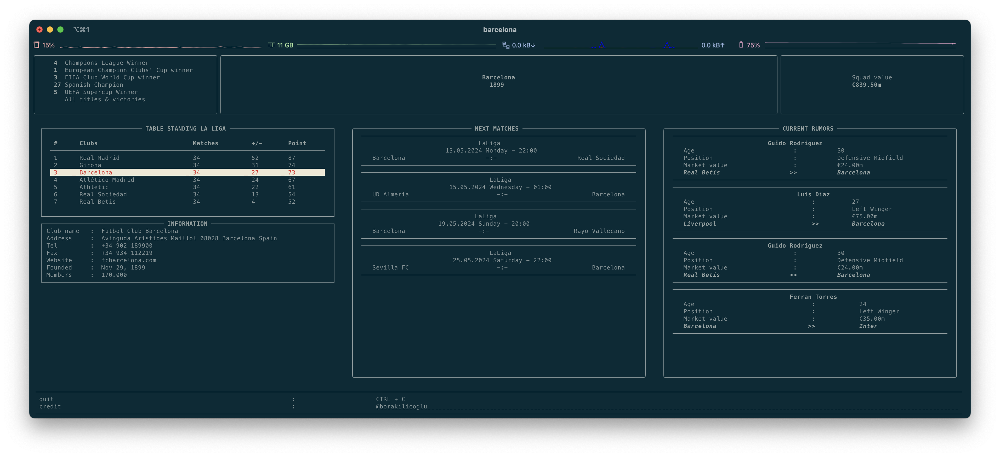
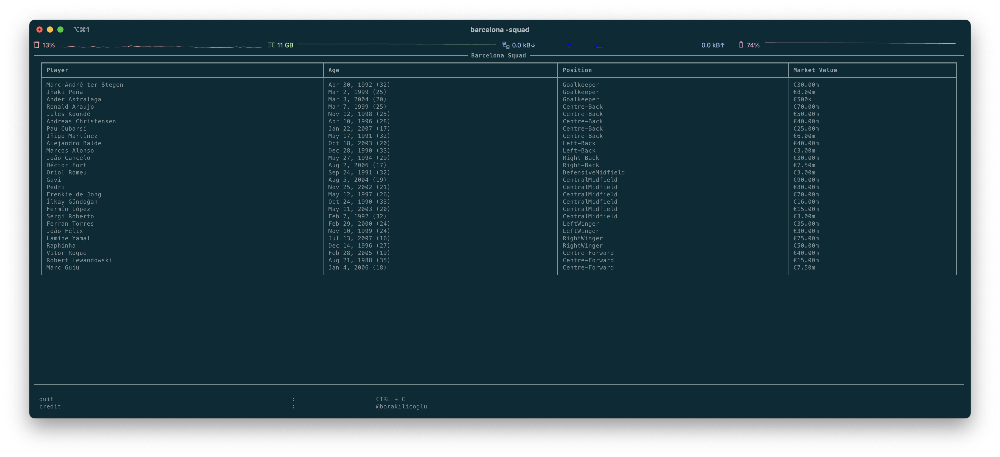
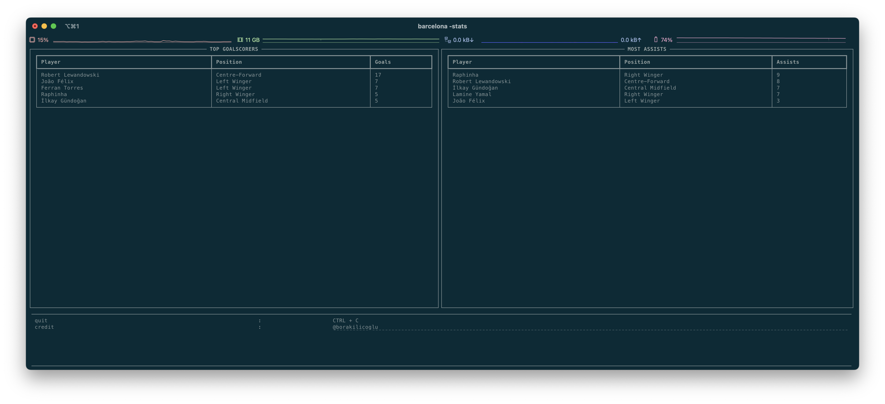

# FC Barcelona CLI Data Tool

This command-line interface (CLI) tool is designed to fetch and display various types of data about FC Barcelona, such as match results, player statistics, and historical data. Built using Python, it is perfect for fans and sports analysts who prefer quick, scriptable access to soccer data without the need for a graphical interface.

## Installation on local

```shell
$ pip install barcelona
```

## Installation with Docker

```shell
$ docker run -ti borakilicoglu/barcelona
```

## Usage

Main Page

```shell summary
$ barcelona
```


List of Players

```shell footballers
$ barcelona -squad
```


List of Top Scorers

```shell footballers
$ barcelona -stats
```


